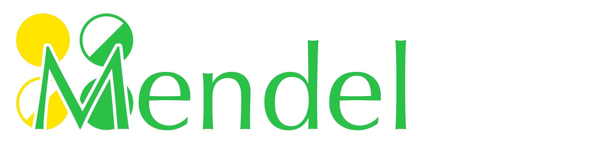

# Mendel Programming Language

## Welcome to Mendel!

Mendel is an user friendly programming language. It has a clean design with modern programming principles. 

Although Mendel is developed based on JavaScript, Mendel is a static typed programming language.

## Getting  Started

### Node.js

Currently, the Mendel is complied using node.js. Node.js can be downloaded on [Node.js](https://nodejs.org).

For Windows user, it might be helpful to have software like PuTTy on your computer.

### Sources

To download the sources for the Mendel, open a terminal and  type in following command.

```bash
git clone amaogou
```

## Testing

### HelloWorld

Let's generate your first Mendel code. 
